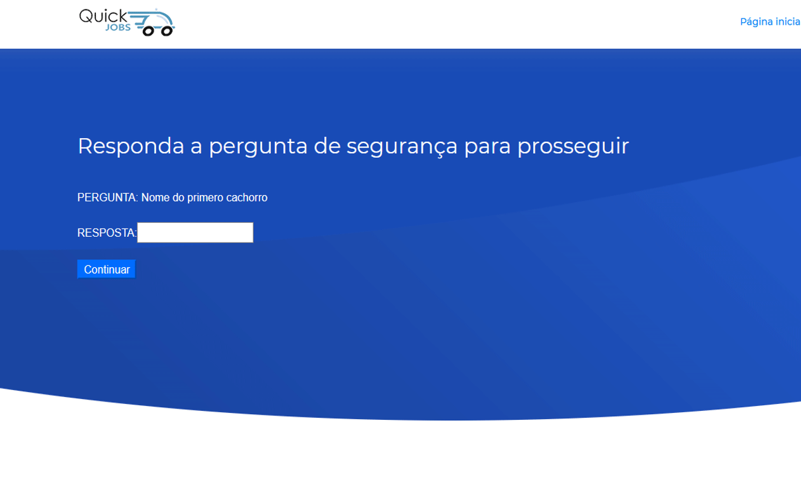

<h1 align="center"></h1>

<h4 align="center"> 
	💯 Site e App de serviços QuickJobs 🆙
</h4>

## 📟 Algumas Interfaces 📇 

 &nbsp;&nbsp;&nbsp;&nbsp;&nbsp;&nbsp;
 &nbsp;&nbsp;&nbsp;&nbsp;&nbsp;&nbsp;

 
 &nbsp;&nbsp;&nbsp;&nbsp;&nbsp;&nbsp;
  &nbsp;&nbsp;&nbsp;&nbsp;&nbsp;&nbsp;   

 
  &nbsp;&nbsp;&nbsp;&nbsp;&nbsp;&nbsp;
  &nbsp;&nbsp;&nbsp;&nbsp;&nbsp;&nbsp;

## 💻 Projeto 📱

    O Site e Aplicativo com o nome de "QuickJobs", fará a interligação entre
interessados de serviços, tanto quem procura quanto para quem serve. Facilitando a
pesquisa e categorização dos trabalhos informais ou formais de acordo com a
qualidade desses, e além disso será possível fazer uma negociação do valor do
serviço pela plataforma. O aplicativo desenvolvido na plataforma Android Studio, terá
uma interação com o usuário, facilitando a sua navegação pelo aplicativo, e o site
desenvolvido na plataforma Visual Studio, terá a função de divulgação do projeto
“QuickJobs”. Com o uso da plataforma, o usuário poderá aumentar sua renda
financeira e também ampliar o mercado de trabalhos, oferecendo serviços a outros
usuários.

  <a href="#Tecnologias">Tecnologias</a>&nbsp;&nbsp;&nbsp;|&nbsp;&nbsp;&nbsp;
    <a href="#Metodologias">Metodologias</a>&nbsp;&nbsp;&nbsp;|&nbsp;&nbsp;&nbsp;
  <a href="#information_source-como-usar">Como Usar</a>&nbsp;&nbsp;&nbsp;|&nbsp;&nbsp;&nbsp;
  <a href="#memo-licença">Licença</a>

## :Tecnologias

Este projeto foi desenvolvido com  as seguintes tecnologias:

- [Asp.NET](https://dotnet.microsoft.com/apps/aspnet)
- [CSharp](https://docs.microsoft.com/pt-br/dotnet/csharp/)
- [JavaScript](https://developer.mozilla.org/pt-BR/docs/Web/JavaScript)
- [HTML5](https://devdocs.io/html/) 
- [CSS3](https://devdocs.io/css/)
- [BootStrap](https://www.w3schools.com/bootstrap/default.asp)
- [Java](https://docs.oracle.com/en/java/)
- [MySQL](https://dev.mysql.com/doc/refman/8.0/en/sql-syntax-data-definition.html)

## :Softwares

Os seguintes softwares foram utilizados neste projeto:

- [Visual Studio 2017](https://visualstudio.microsoft.com/pt-br/) 
- [Android Studio](https://developer.android.com/studio)
- [Adobe](https://www.adobe.com/pt/creativecloud.html)
- [Figma](https://www.figma.com/)

## :Metodologias

Artigos que estou a publicar no Medium que explica resumidamente cada metodologia utilizada :

- [Design UX](#) 
- [Design Sprint](#)
- [Design UI](#)
- [Scrum](#)

## :information_source: Como Usar

Para executar essa aplicação você vai precisar de Visual Studio 2017, MySQL Server 5.5 and Android Studio 3.5 e o banco de dados do projeto para carregar os inserts do mesmo.

## :memo: Licença
Este projeto está sob licença MIT. Veja a [LICENSE] para mais informações.

---

Feito com 🎧 ♥ 😊 😥 
 por Adilson Oliveira :wave: [Get in touch!] www.linkedin.com/in/adilson-p-oliveira

